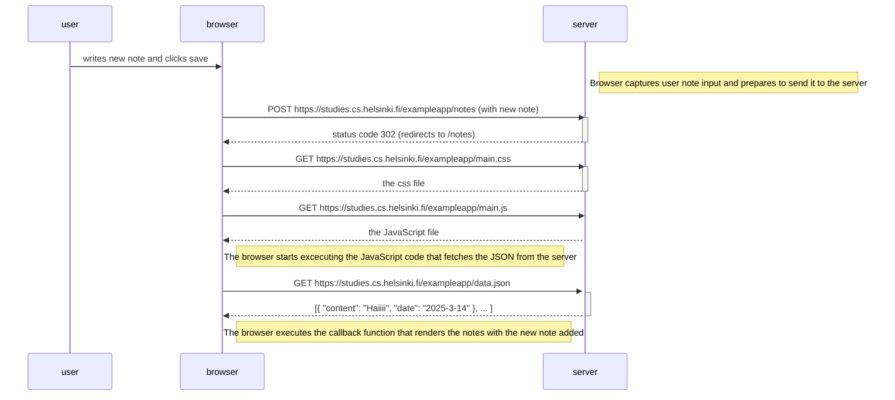

# exercise 0.4

```mermaid

sequenceDiagram
    participant user
    participant browser
    participant server 

    user->>browser: writes new note and clicks save
    Note right of server: Browser captures user note input and prepares to send it to the server

    browser->>server: POST https://studies.cs.helsinki.fi/exampleapp/notes (with new note)
    activate server
    server-->>browser: status code 302 (redirects to /notes)
    deactivate server

    browser->>server: GET https://studies.cs.helsinki.fi/exampleapp/main.css
    activate server
    server-->>browser: the css file
    deactivate server

    browser->>server: GET https://studies.cs.helsinki.fi/exampleapp/main.js
    activate server
    server-->>browser: the JavaScript file

    note right of browser: The browser starts excecuting the JavaScript code that fetches the JSON from the server

    browser->>server: GET https://studies.cs.helsinki.fi/exampleapp/data.json
    activate server
    server-->>browser: [{ "content": "Haiiii", "date": "2025-3-14" }, ... ]
    deactivate server

    note right of browser: The browser executes the callback function that renders the notes with the new note added

```