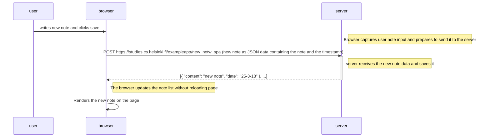

# exercise 6

```mermaid

sequenceDiagram
    participant user
    participant browser
    participant server 

    user->>browser: writes new note and clicks save
    Note right of server: Browser captures user note input and prepares to send it to the server

    browser->>server: POST https://studies.cs.helsinki.fi/exampleapp/new_notw_spa (new note as JSON data containing the note and the timestamp)
    activate server
    note right of server: server receives the new note data and saves it
    server-->>browser: [{ "content": "new note", "date": "25-3-18" }, ...]
    deactivate server

    Note right of browser: The browser updates the note list without reloading page 
    browser->>browser: Renders the new note on the page

   

```